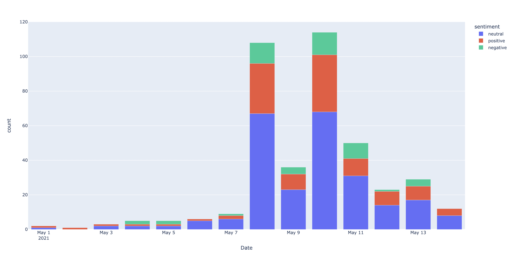

# Minds Programming Assignment
<h2>How to run the code</h2>

1. Check python3 is installed using ```python --version```
2. Clone the repository
3. Navigate to MindsProgrammingAssignment folder in your terminal
4. Run ```python TelegramAnalysis.py```

Wait until the progressbar completes and it should open the plot in your default browser once its completed.

Note: You should be inside MindsProgrammingAssignment folder as data resides there.
<h2>Code Documentation</h2>
The below cell reads data from json normalizes data into dataframe. After that we format the date timestamp to Date.
<br>

<kbd>
 <div>
with open('result.json','r') as f:<br>
&emsp;&emsp;&emsp;&emsp;data = json.loads(f.read())<br><br>
   
df_nested_list = pd.json_normalize(data, record_path =['messages'])<br>
df_nested_list = df_nested_list[['date','text']]
<br><br>
df_nested_list['Date'] = pd.to_datetime(df_nested_list['date']).apply(lambda x: x.date())<br>
df_nested_list.drop(['date'],inplace=True,axis=1)
</div>
</kbd>
<br><br>
The below function is responsible to remove any non-characters in messages, hence cleaning up the loaded messages to only valid strings.
<br>

<kbd>
 <div>
def preProcess(msg)
</div>
</kbd>
<br><br>
The below function is responsible to remove any non-english messages and all the messages that do not contain "SHIB" or "DOGE."
<br>

<kbd>
 <div>
def def removeNonEn(text)
</div>
</kbd>
<br><br>
The below cell does the sentiment anlysis on every message and returns if the mesaage is neutral, negative or positive.
<br>

<kbd>
 <div>
df_nested_list["sentiment_score"] = df_nested_list["text"].apply(lambda x: TextBlob(str(x)).sentiment.polarity)<br>
df_nested_list["sentiment"] = np.select([df_nested_list["sentiment_score"] < 0, df_nested_list["sentiment_score"] == 0, df_nested_list["sentiment_score"] > 0],
                           ['negative', 'neutral', 'positive'])
</div>
</kbd>
<br><br>
Lastly, we use plotly to plot the bar chart for sentiments per day per number of messages.
<br>

<kbd>
 <div>
fig = px.bar(sentimentCount, x="Date", y="count", color="sentiment")<br>
fig.show()
</div>
</kbd>


<h2>Summary of Results</h2>
I took messages from CryptoComOfficial telegram channel, the data included messages from 1 to 15 May. The sentiments of each messages were analysed and plotted in form of bar graph. I came to the conclusion that the during this duration most of the messages were neutral after analysing sentiments of each message and plotting it per day.


